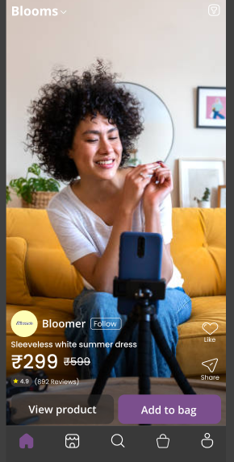
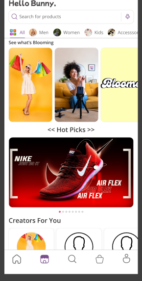

# 📱 Bloomer – Video-First Shopping App

Bloomer is a **video-first shopping experience** that blends social engagement with e-commerce.  
Sellers and creators upload short product reels, while buyers **swipe, watch, and shop instantly**.  
This delivers a **fun, authentic, and trust-driven shopping experience**.  

---

## 🚀 Features

- 🎥 **Video-first shopping** – browse short product reels  
- 🛒 **Seamless shopping** – add to cart & checkout directly from videos  
- 🤝 **Creator-friendly** – sellers & influencers can upload authentic product reels  
- 🔎 **Smart discovery** – swipe to explore trending, recommended, or new products  
- 📱 **Mobile-first UI** – smooth, engaging, and intuitive experience  

---

## 📸 Screenshots  

> Place your screenshots inside a `/screenshots` folder in this repo.  

| Home Feed | Product Reel | Checkout |
|-----------|--------------|----------|
|  |  |

---

